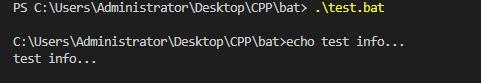
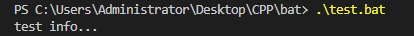

编辑一个bat脚本，运行的时候会发现有这样一个问题。

```shell
echo test info...
```



在上面的执行结果中可以看到，执行`echo`命令打印信息前，多了一行当前正在执行命令的显示。

想要执行本次文件过程中都不出现这种情况，可以用`@echo off`来关闭。

```shell
@echo off
echo test info...
```



这个时候就发现，没有上述的多余打印了。