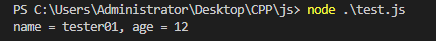
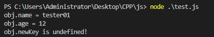

js的对象定义方法一般都是这样的：

```JS
let obj = {
    name: 'tester01',
    age: 12
};
```

# 1、一般写法

一般的写法下，想要读取这个对象的`key`-`value`对应值就需要按照对应的键名来检索。

```JS
let objName = obj.name;
let objAge = obj.age;
console.log(`name = ${objName}, age = ${objAge}`)
```

打印结果：



# 2、特殊用法

现在有一种特殊的写法。我可以先定义好一个数组，存储这个对象里面的所有`key`的字符串，然后按照这个`key`的字符串名称去检索对应`value`。

```JS
let keyArr = [ 'name', 'age', 'newKey' ];
for (let i = 0; i < keyArr.length; i++) {
    if (obj[keyArr[i]]) {
        console.log(`obj.${keyArr[i]} = ${obj[keyArr[i]]}`);
    } else {
        console.log(`obj.${keyArr[i]} is undefined!`);
    }
}
```

打印结果：

