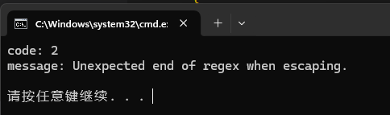

# 初始化

```C++
#include <regex>

std::regex reg("regex");
```

其中的`regex`为正则匹配的规则，详细的规则可以看[正则匹配规则介绍](../../通用知识点/0001、正则表达式语法.md)。

# 正则匹配接口

## 1、std::regex_match

检查整个字符串是否完全匹配正则表达式。

```C++
std::string rawStr = "my phone number is 10086.";
// 匹配是否存在五个连续数字组成的号码
std::regex regMatch("^.*[0-9]{5}.*$");
if (std::regex_match(rawStr, regMatch)) {
    std::cout << "Match succeed" << std::endl;
} else {
    std::cout << "Match failed" << std::endl;
}
```

执行后可以看到结果为成功匹配到。


## 2、std::regex_search

检查字符串中是否存在符合正则表达式的子字符串。

```C++
std::string rawStr = "my phone number is 10086.";
// 匹配是否存在五个连续数字组成的号码
std::regex regSearch("[0-9]{5}");
if (std::regex_search(rawStr, regSearch)) {
    std::cout << "Search succeed" << std::endl;
} else {
    std::cout << "Search failed" << std::endl;
}
```

执行后可以看到结果为成功匹配到。


## 3、std::regex_replace

```C++
std::string rawStr = "my phone number is 10086.";
std::regex regReplace("[0-9]");
// 把所有的数字替换成*
std::string replaceRes = std::regex_replace(rawStr, regReplace, "*");
std::cout << replaceRes << std::endl;
```

执行后可以看到结果为成功替换。


## 4、错误信息捕获

正则表达式中的错误通常会抛出`std::regex_error`异常。可以通过`std::regex_error`的成员函数`code()`获取错误码，成员函数`what()`获取错误相关的描述字符串。

```C++
try {
    // 这里初始化的正则表达式是非法的
    std::regex reg("\\");
} catch (const std::regex_error& e) {
    std::cout << "code: " << e.code() << std::endl
        << "message: " << e.what() << std::endl;
}
```

执行后可以看到错误码以及错误信息。


