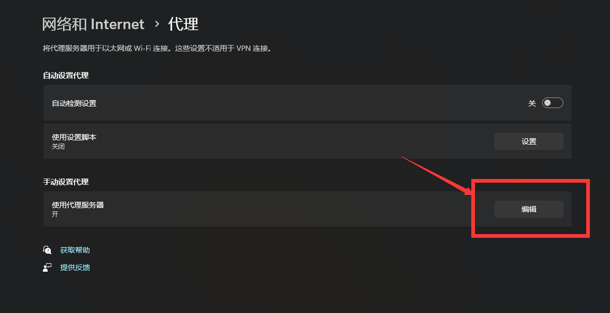

# 1、问题描述

当`push`代码到远程仓库时，会报错`Time out`，见下图：


# 2、解决方法

目前的解决方法无非就是下面这几种的一种或者混用。

## 2-1、刷新dns

```shell
ipconfig /flushdns
```

## 2-2、取消代理

```shell
git config --global --unset http.proxy 
git config --global --unset https.proxy
```

## 2-3、设置代理

现在系统设置里面查看有没有代理。




从这里可以看到`代理IP地址`和`代理端口号`。

然后利用这个`代理IP地址`和`代理端口号`执行下列命令。

```shell
git config --global http.proxy http://127.0.0.1:9910
git config --global https.proxy https://127.0.0.1:9910
```

设置完成后可以用下面的命令查看设置结果。

```shell
git config --global -l
```