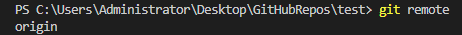

# 1、新建分支

```shell
git branch <new_branch_name>
# 举例：
#   git branch test
#   这个时候就创建了一个名为'test'的分支
```

执行上面命令新建分支后，可以用下面的命令查看当前所有分支。

```shell
git branch
```

# 2、切换到新分支

```shell
git checkout <branch_name>
# 举例：
#   git checkout test
#   这个时候就把当前分支切换成了'test'
```

或者

```shell
git chechout -b <branch_name>
# 举例：
#   git chechout -b test
#   这个时候就把当前分支切换成了'test'
```

就可以切换到目标分支

# 3、将新建分支推送到远程仓库

```shell
git push <remote_name> <branch_name>
# 举例：
#   remote_name一般默认都是origin
#   git push origin test
```

其中的`remote_name`可以用下面的命令查询。

```shell
git remote
```

